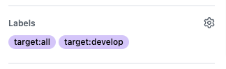

# set-terraform-matrix
This Action is used to dynamically generate Terraform's working directory using GitHub PR Label, in use with [build-matrix](https://docs.github.com/en/actions/using-jobs/using-a-build-matrix-for-your-jobs).

## Setup
### GitHub Label
Create the following labels. Unnecessary labels can be omitted.

- `target:all`
- `target:develop`
- `target:staging`
- `target:production`

https://docs.github.com/en/issues/using-labels-and-milestones-to-track-work/managing-labels#creating-a-label

### Deploy target file
Create a json file in the following format. Specify the deployment stage as key and target directory as value.  
The config file name or directory can be specified, but `.github/workflows/deploy_target.json` is used by default.

```json
{
    "develop": [
        "envs/dev"
    ],
    "staging": [
        "envs/stg"
    ],
    "production": [
        "envs/prod"
    ]
}
```
Currently supported keys are `develop` / `staging` / `production`.

### Workflow
GitHub Actions are configured as follows:
```yaml
jobs:
  set-matrix:
    runs-on: ubuntu-latest

    outputs:
      workdir: ${{ steps.set_matrix.outputs.matrix-workdir }}

    steps:
      - name: checkout
        uses: actions/checkout@v3

      - name: Set matrix
        id: set_matrix
        uses: ponkio-o/set-terraform-matrix@main
        with:
          PR_NUMBER: ${{ github.event.number }}
  plan:
    needs: [set-matrix]
    name: terraform plan
    runs-on: ubuntu-latest

    strategy:
      matrix:
        workdir: ${{fromJson(needs.set-matrix.outputs.workdir)}}

    steps:
      - name: Checkout
        uses: actions/checkout@v3

      - name: Setup terraform
        uses: hashicorp/setup-terraform@v1
  
      - name: Terraform plan
        working-directory: ${{ matrix.workdir }}
        run: terraform plan -input=false -no-color
```

## Usage
Deploy to all enviornment  


Deploy to development & staging  


If `target:all` is included in multiple selections as follows, `target:all` always takes precedence.  


If you target label is not set, the following message is post in PR.  


### Action inputs
|Name                |Require|Description                                                                                                                                                                                      |Default                               |
|--------------------|-------|-------------------------------------------------------------------------------------------------------------------------------------------------------------------------------------------------|--------------------------------------|
|`deploy_target_file`|false  |The json file defined the deploy target.                                                                                                                                                         |`.github/workflows/deploy_target.json`|
|`token`             |false  |`GITHUB_TOKEN` (permissions `pull-request: write`) or [PersonalAccessToken(PAT)](https://docs.github.com/en/authentication/keeping-your-account-and-data-secure/creating-a-personal-access-token)|`GITHUB_TOKEN`                        |

### Action outputs
The working directory i outputs as an array. If `target:all` is specified, the following array is output.
```bash
["envs/dev","envs/stg","envs/prod"]
```
